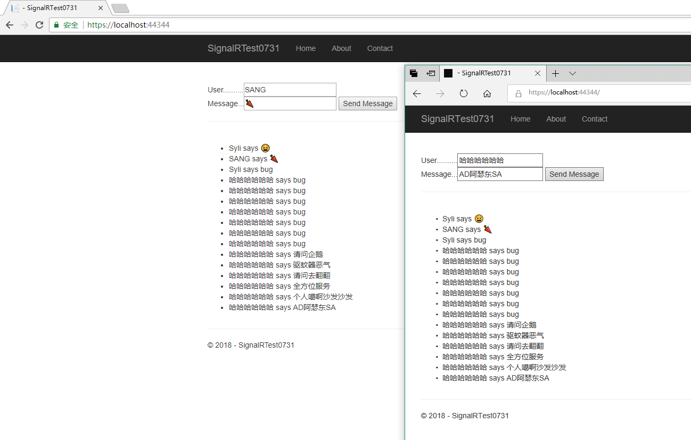

# SignalRCodePractice

## SignalR教程练习：

https://docs.microsoft.com/en-us/aspnet/core/tutorials/signalr?view=aspnetcore-2.1&amp;tabs=visual-studio

####  只需几步就可完成聊天室的搭建

### 推荐一个Signal R小程序的教程
https://www.cnblogs.com/LiangSW/p/9415246.html

### 已整合进来 https://github.com/liangshiw/SignalRMiniProgram-Client
